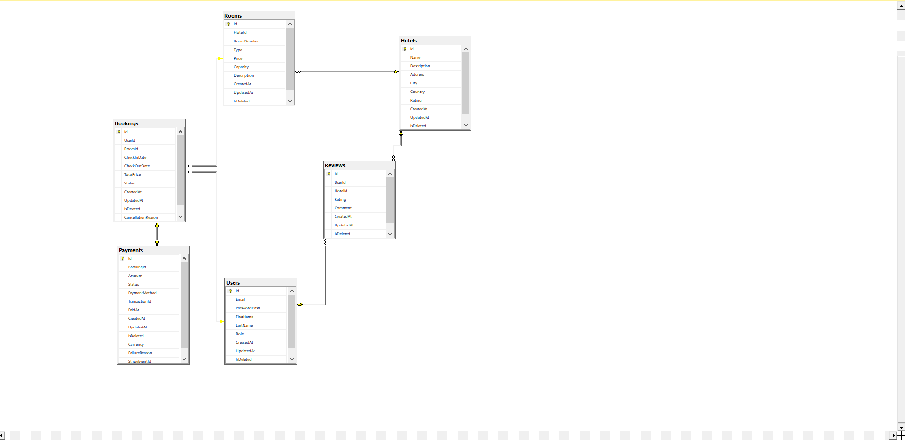

# Therapy Companions API

> **Note**: This is the technical documentation for the Therapy Companions API. For an overview of the entire project, please see the [root README](../README.md).

## 🏗️ Architecture

### Clean Architecture Layers

The solution follows Clean Architecture principles with the following layers:

1. **Domain Layer**

   - Entities, value objects, domain events
   - Enums, Statuses for Payments or Booking, Roles
   - Repository interfaces

2. **Application Layer**

   - Application business rules
   - Use cases (Commands & Queries)
   - DTOs and mapping profiles
   - Validation rules
   - Interfaces for external services
   - Exceptions
   - Behaviors
   - Pagination and PagedList

3. **Infrastructure Layer**

   - Data access (Entity Framework Core)
   - External services (Email, JWT, Storage, Stripe, etc.)
   - Authentication and authorization
   - Caching and logging
   - Repositories And Extensions

4. **API Layer**
   - Controllers
   - Middleware
   - Request/response models
   - API documentation (Swagger)

### Key Design Patterns

| Pattern                  | Implementation        | Description                         |
| ------------------------ | --------------------- | ----------------------------------- |
| **CQRS**                 | MediatR               | Separates read and write operations |
| **Repository**           | Generic Repository    | Abstracts data access               |
| **Unit of Work**         | DbContext             | Manages transactions                |
| **Specification**        | Specification Pattern | Encapsulates query logic            |
| **Fluent Validation**    | FluentValidation      | Request validation                  |
| **Dependency Injection** | .NET Core DI          | Loose coupling                      |

### Technology Stack

- **Runtime**: .NET 8.0
- **Framework**: ASP.NET Core 8.0
- **Database**: SQL Server 2022
- **ORM**: Entity Framework Core 8.0
- **Authentication**: JWT Bearer Tokens
- **Caching**: MemoryCache
- **Logging**: Serilog
- **Testing**: xUnit, Moq

## 📚 API Documentation

### Swagger UI

The API documentation is available via Swagger UI at `/swagger` when running the application.

### API Versioning

The API uses URL-based versioning (e.g., `/api/v1/controller`). Current version: `v1`

### Response Format

All responses follow the same JSON structure:

```json
{
  "success": true,
  "data": {},
  "message": "Operation completed successfully",
  "errors": null
}
```

### Error Handling

Standard error responses include:

```json
{
  "type": "https://tools.ietf.org/html/rfc7231#section-6.5.1",
  "title": "One or more validation errors occurred.",
  "status": 400,
  "errors": {
    "PropertyName": ["Error message"]
  },
  "traceId": "00-1234567890abcdef1234567890abcdef-9876543210fedcba-00"
}
```

## 🔐 Authentication

The API uses JWT (JSON Web Tokens) for authentication.

### Obtaining a Token

1. Register a new user:

   ```http
   POST /api/auth/register
   Content-Type: application/json

   {
      "FirstName" = "Ahamed",
      "LastName" = "Meeran",
      "email": "user@example.com",
      "password": "P@ssw0rd!",
      "Role": 0
   }
   ```

2. Login to get a token:

   ```http
   POST /api/auth/login
   Content-Type: application/json

   {
     "email": "user@example.com",
     "password": "P@ssw0rd!"
   }
   ```

3. Use the token in subsequent requests:
   ```
   Authorization: Bearer <your-jwt-token>
   ```

### Roles and Permissions

| Role             | Permissions                                         |
| ---------------- | --------------------------------------------------- |
| **Customer**     | View hotels, rooms, Book rooms, manage own bookings |
| **HotelManager** | Manage hotels and rooms                             |
| **Admin**        | Full system access                                  |

## 💾 Database

### Entity Relationship Diagram



### Migrations

To create a new migration:

```bash
dotnet ef migrations add <MigrationName> --project src/Infrastructure --startup-project src/API
```

To apply migrations:

```bash
dotnet ef database update --project src/Infrastructure --startup-project src/API
```

### Seeding Data

To seed the database with test data:

```bash
dotnet run --project src/API --seed
```

## 🧪 Testing

### Running Tests

```bash
# Unit tests
dotnet test tests/Therapy_Companion.UnitTests -c Release

# Integration tests
dotnet test tests/Therapy_Companion.IntegrationTests -c Release

# All tests with coverage report
dotnet test /p:CollectCoverage=true /p:CoverletOutputFormat=opencover
```

## 🚀 Deployment

### Docker

Build the Docker image:

```bash
docker build -t hotel-booking-api .
```

Run with Docker Compose:

```bash
docker-compose -f ../docker-compose.prod.yml up -d
```

### Code Style

- Follow [.NET Coding Conventions](https://docs.microsoft.com/en-us/dotnet/csharp/fundamentals/coding-style/coding-conventions)
- Use meaningful commit messages
- Write unit tests for new features
- Update documentation when necessary

## 📄 License

This project is licensed under the MIT License - see the [LICENSE](../LICENSE) file for details.

## 🚀 Quick Start

### Prerequisites

- [.NET 8.0 SDK](https://dotnet.microsoft.com/download/dotnet/8.0)
- [SQL Server 2019+](https://www.microsoft.com/en-us/sql-server/sql-server-downloads) or Docker
- [Git](https://git-scm.com/)
- [Postman](https://www.postman.com/) (for API testing)

### Running the Application

1. **Clone the repository**

   ```bash
   git clone https://github.com/Dev-Ahmed-Ashraf/Therapy_Companion_API.git
   cd Therapy_Companion_API
   ```

2. **Configure the application**

   - Copy `appsettings.Development.example.json` to `appsettings.Development.json`
   - Set up user secrets for sensitive data:
     ```bash
     dotnet user-secrets init
     dotnet user-secrets set "ConnectionStrings:DefaultConnection" "Server=.;Database=TherapyCompanionDb;Trusted_Connection=true;TrustServerCertificate=True;"
     dotnet user-secrets set "JwtSettings:SecretKey" "Your-Super-Secret-Key-At-Least-32-Chars-Long"
     dotnet user-secrets set "Stripe:SecretKey" "your-stripe-secret-key"
     ```

3. **Run database migrations**

   ```bash
   cd src/Therapy_Companion_API
   dotnet ef database update
   ```

4. **Run the application**

   ```bash
   dotnet run --project src/Therapy_Companion_API
   ```

5. **Access the application**
   - API: `https://localhost:7062`
   - Swagger UI: `https://localhost:7062/swagger`
   - Health Check: `https://localhost:7062/health`

### Using Docker

```bash
docker-compose -f docker-compose.yml -f docker-compose.override.yml up -d --build
```

## 🧾 Postman Collection

To test all API endpoints:

1. Import the following files into Postman:
   - `Therapy Companions API.postman_collection.json`
   - `Therapy_Companion_Environment.postman_environment.json`
2. Update the environment variables in Postman:
   - `baseUrl`: Your API base URL (e.g., `https://localhost:7062`)
   - `jwt`: Will be automatically set after login
3. Run the `Authentication/Login` request to generate an access token
4. All secured endpoints will automatically use the saved token
5. Explore the collection's folders for different API resources

### Testing Workflow

1. **Authentication**: Start with the Authentication folder
2. **Hotels & Rooms**: Browse and manage properties
3. **Bookings**: Create and manage reservations
4. **Reviews**: Add and manage hotel reviews
5. **Admin**: Administrative operations (requires admin role)

### Example: Create a Booking

1. Use `GET /api/rooms/available` to find available rooms
2. Use `POST /api/bookings` to create a booking
3. Use `POST /api/payments/intents` to create a payment intent
4. Use `GET /api/bookings/{id}` to check booking status

## 🔧 Configuration

### Application Settings

#### Database Configuration

```json
{
  "ConnectionStrings": {
    "DefaultConnection": "Server=.;Database=TherapyCompanionDb;Trusted_Connection=true;TrustServerCertificate=True;"
  }
}
```

#### JWT Configuration

```json
{
  "JwtSettings": {
    "SecretKey": "<set-via-user-secrets-or-env-var>",
    "Issuer": "TherapyCompanionAPI",
    "Audience": "TherapyCompanionAPI-Users",
    "ExpirationMinutes": 1440
  }
}
```

#### Stripe Configuration (for payments)

```json
{
  "Stripe": {
    "ApiKey": "",
    "PublishableKey": "<your-publishable-key>",
    "SecretKey": "<set-via-user-secrets-or-env-var>",
    "WebhookSecret": "<set-via-user-secrets-or-env-var>"
  }
}
```

#### Email Configuration (SMTP)

```json
{
  "SmtpSettings": {
    "Host": "smtp.example.com",
    "Port": 587,
    "Username": "your-email@example.com",
    "Password": "<set-via-user-secrets-or-env-var>",
    "SenderEmail": "noreply@TherapyCompanion.com",
    "SenderName": "Therapy Companions API",
    "EnableSsl": true
  }
}
```

### Environment Variables

For production, set these environment variables:

```bash
# Database
ASPNETCORE_ENVIRONMENT=Production
ConnectionStrings__DefaultConnection=Server=...

# JWT
JwtSettings__SecretKey=your-super-secret-key

# Stripe
Stripe__SecretKey=sk_test_...
Stripe__WebhookSecret=whsec_...

# Email
SmtpSettings__Username=your-email@example.com
SmtpSettings__Password=your-email-password
```

## 🗄️ Database Management

### Migrations

#### Create a new migration

```bash
dotnet ef migrations add <MigrationName> --project src/Therapy_Companion_API.Infrastructure --startup-project src/Therapy_Companion_API.API
```

#### Apply migrations

```bash
dotnet ef database update --project src/Therapy_Companion_API.Infrastructure --startup-project src/Therapy_Companion_API.API
```

#### Generate SQL Script

```bash
dotnet ef migrations script --output migrations.sql --project src/Therapy_Companion_API.Infrastructure --startup-project src/Therapy_Companion_API.API
```

### Seeding Data

To seed the database with initial data:

```bash
dotnet run --project src/Therapy_Companion_API.API --seed
```

### Backup and Restore

#### Create Backup

```sql
BACKUP DATABASE TherapyCompanionDb
TO DISK = 'C:\Backups\TherapyCompanionDb.bak'
WITH FORMAT, COMPRESSION;
```

#### Restore from Backup

```sql
RESTORE DATABASE TherapyCompanionDb
FROM DISK = 'C:\Backups\TherapyCompanionDb.bak'
WITH REPLACE, RECOVERY;
```

## 📚 API Reference

### Base URL

```
https://api.TherapyCompanion.com/v1  # Production
https://localhost:7062           # Development
```

### Authentication

All endpoints except `/api/auth/*` require a valid JWT token in the `Authorization` header:

```
Authorization: Bearer <your-jwt-token>
```

### Rate Limiting

- **Public Endpoints**: 100 requests per minute per IP
- **Authenticated Endpoints**: 1000 requests per minute per user
- **Admin Endpoints**: 5000 requests per minute per user

### Response Format

All responses follow the same JSON structure:

```json
{
  "success": true,
  "data": {},
  "message": "Operation completed successfully",
  "errors": null
}
```

### Error Responses

| Status Code | Description                                  |
| ----------- | -------------------------------------------- |
| 400         | Bad Request - Invalid input                  |
| 401         | Unauthorized - Authentication required       |
| 403         | Forbidden - Insufficient permissions         |
| 404         | Not Found - Resource not found               |
| 409         | Conflict - Resource conflict                 |
| 429         | Too Many Requests - Rate limit exceeded      |
| 500         | Internal Server Error - Something went wrong |

## 📚 API Endpoints

### Authentication

- `POST /api/auth/register` - Register a new user
- `POST /api/auth/login` - Login and get JWT token

### Hotels

- `GET /api/hotels` - Get all hotels (with pagination and search)
- `POST /api/hotels` - Create hotel (Admin only)
- `GET /api/hotels/{id}` - Get hotel by ID
- `PUT /api/hotels/{id}` - Update hotel (Admin only)
- `DELETE /api/hotels/{id}` - Delete hotel (Admin only)

### Rooms

- `GET /api/rooms/hotel/{hotelId}` - Get rooms by hotel
- `POST /api/rooms` - Create room (Admin/Hotel Manager)
- `GET /api/rooms/available` - Get available rooms with filters
- `PUT /api/rooms/{id}` - Update room (Admin/Hotel Manager)

### Bookings

- `POST /api/bookings` - Create booking (Customer/Admin)
- `GET /api/bookings/{id}` - Get booking by id (Authorized)
- `GET /api/bookings` - List bookings with pagination and filters (Admin)
- `PATCH /api/bookings/{id}` - Update booking dates (Customer/Admin)
- `DELETE /api/bookings/{id}` - Delete or soft-delete booking (Owner/Admin)
- `POST /api/bookings/{id}/cancel` - Cancel booking (Owner/Admin)
- `PATCH /api/bookings/{id}/status` - Change booking status (Admin/HotelManager)
- `GET /api/bookings/user/{userId}` - Get bookings for a user (Owner/Admin)
- `GET /api/bookings/hotel/{hotelId}` - Get bookings for a hotel (Admin/HotelManager)
- `GET /api/bookings/check-availability` - Public: check room availability
- `GET /api/bookings/calculate-price` - Public: calculate booking price

### Reviews

- `GET /api/reviews/hotel/{hotelId}` - Get hotel reviews
- `POST /api/reviews` - Create review
- `PUT /api/reviews/{id}` - Update review
- `DELETE /api/reviews/{id}` - Delete review

### Payments (Stripe Test Mode)

- `POST /api/payments/intents` - Create Stripe PaymentIntent for a booking
- `GET /api/payments/{id}` - Get payment by id
- `GET /api/bookings/{bookingId}/payment` - Get payment by booking

## 🔐 Authentication & Authorization

The API uses JWT (JSON Web Tokens) for stateless authentication.

### Authentication Flow

1. **Login**

   - Submit credentials to `/api/auth/login`
   - Receive access token and refresh token

   ```json
   {
     "accessToken": "eyJhbGciOiJIUzI1NiIsInR5cCI6IkpXVCJ9...",
     "refreshToken": "8bF3f7dE2a...",
     "expiresIn": 3600,
     "tokenType": "Bearer"
   }
   ```

2. **Using the Access Token**

   - Include in `Authorization` header for protected endpoints
   - Token expires after 1 hour (configurable)

3. **Refreshing Tokens**
   - Use the refresh token to get a new access token
   - POST to `/api/auth/refresh-token` with the refresh token

### User Roles & Permissions

| Role              | Permissions                                                                                                             |
| ----------------- | ----------------------------------------------------------------------------------------------------------------------- |
| **Customer**      | All guest permissions, plus:<br>• Book rooms<br>• Manage own bookings<br>• Write reviews                                |
| **Hotel Manager** | All customer permissions, plus:<br>• Manage hotel details<br>• Manage rooms for assigned hotels<br>• View hotel reports |
| **Admin**         | Full system access, including:<br>• User management<br>• System configuration<br>• All CRUD operations                  |

### Role-Based Access Control

Endpoints are protected using `[Authorize]` attributes:

```csharp
[Authorize]  // Any authenticated user
[Authorize(Roles = "Admin")]  // Admin only
[Authorize(Roles = "Admin,HotelManager")]  // Admin or Hotel Manager
```

### Security Headers

The API includes security headers by default:

- **Content-Security-Policy**
- **X-Content-Type-Options: nosniff**
- **X-Frame-Options: DENY**
- **X-XSS-Protection: 1; mode=block**
- **Strict-Transport-Security** (in production)

## 🛠 Advanced Configuration

### Logging

The application uses Serilog for structured logging with the following sinks:

- **Console** - Human-readable logs during development
- **File** - JSON-formatted logs in production
- **Seq** - Optional centralized logging (configure in appsettings.Production.json)

#### Log Levels

- **Information**: General application flow
- **Warning**: Exceptional circumstances that don't stop execution
- **Error**: Unhandled exceptions and errors
- **Fatal**: Critical errors causing application failure

### Caching

Response caching is configured for performance:

```csharp
services.AddResponseCaching(options =>
{
    options.MaximumBodySize = 1024;
    options.UseCaseSensitivePaths = true;
});
```

### Health Checks

Endpoints for monitoring application health:

- `/health` - Basic health status
- `/health/detailed` - Detailed health information
- `/health/ready` - Readiness probe
- `/health/live` - Liveness probe

### API Versioning

The API supports versioning via:

- URL path: `/api/v1/controller`
- Query string: `/api/controller?api-version=1.0`
- Header: `X-API-Version: 1.0`

Configured in `Program.cs`:

```csharp
services.AddApiVersioning(options =>
{
    options.DefaultApiVersion = new ApiVersion(1, 0);
    options.AssumeDefaultVersionWhenUnspecified = true;
    options.ReportApiVersions = true;
});
```

### Performance Optimization

- **Response Compression**: Enabled for all responses
- **Pagination**: Default page size of 20 items, configurable up to 100
- **EF Core Optimization**:
  - Asynchronous database operations
  - Compiled queries for frequently used queries
  - No-tracking queries for read-only operations

### Security Headers

Security headers are added via middleware:

```csharp
app.UseSecurityHeaders(policies => policies
    .AddDefaultSecurityHeaders()
    .AddContentSecurityPolicy(builder =>
    {
        builder.AddDefaultSrc().Self();
        builder.AddConnectSrc().Self()
            .From("https://*.stripe.com");
        // Additional CSP rules...
    })
);
```

````
For local development, use `appsettings.Development.json` with localhost origins.

### Stripe Settings
```json
{
  "Stripe": {
    "ApiKey": "sk_test_xxx",
    "WebhookSecret": "whsec_xxx",
    "PublishableKey": "pk_test_xxx",
    "Currency": "usd"
  }
}
````

#### Stripe Test Cards

- Number: `4242 4242 4242 4242`
- Expiry: any future date
- CVC: any 3 digits

#### Webhook Testing (Stripe CLI)

```bash
stripe login
stripe listen --forward-to https://localhost:7062/api/stripe/webhook
```

When a PaymentIntent is confirmed (test mode), Stripe sends `payment_intent.succeeded` which updates local `Payment` to Completed and sets `Booking` to Confirmed.

## 🧪 Testing the API

Use the provided `Therapy_Companion.http` file with VS Code REST Client extension or any HTTP client:

1. **Register a new user**:

   ```http
   POST https://localhost:7062/api/auth/register
   Content-Type: application/json

   {
     "email": "john.doe@example.com",
     "password": "SecurePass123!",
     "firstName": "John",
     "lastName": "Doe",
     "role": 0
   }
   ```

2. **Login**:

   ```http
   POST https://localhost:7062/api/auth/login
   Content-Type: application/json

   {
     "email": "admin@TherapyCompanion.com",
     "password": "Admin123!"
   }
   ```

3. **Get hotels**:
   ```http
   GET https://localhost:7062/api/hotels?pageNumber=1&pageSize=10
   ```

## 📁 Project Structure

```

Therapy_Companion_API_Project/
├── Therapy_Companion_API/ # API Layer (Presentation)
│ ├── Controllers/ # API Controllers
│ ├── Middleware/ # Custom middleware
│ └── Program.cs # Application entry point
│
├── Application/ # Application Layer
│ ├── Common/ # Shared DTOs, Interfaces
│ ├── Features/ # Feature folders
│ │ ├── Bookings/
│ │ ├── Hotels/
│ │ ├── Rooms/
│ │ ├── Reviews/
│ │ ├── Payments/
│ │ ├── Auth/
│ │ └── AdminDashboard/
│ ├── DTOs
│ ├── Validators
│ └── Mapping
│
├── Domain/ # Domain Layer
│ ├── Entities/ # Domain models
│ ├── Enums/
│ └── Interfaces/
│
├── Infrastructure/ # Infrastructure Layer
│ ├── Data/ # DbContext and configurations
│ ├── Caching/ # Caching for Performance
│ ├── Services/ # External services
│ ├── Repositories/ # Repositories
│ └── Extensions/ # Extensions
│
├── tests/ # Test projects
│ ├── UnitTests/ # Unit tests
│ └── IntegrationTests/ # Integration tests
│
├── .github/workflows/ # GitHub Actions workflows
│ └── dotnet.yml # CI/CD pipeline
│
├── screenshots/ # Project screenshots
├── Dockerfile # Production container
├── docker-compose.yml # Local development stack
└── README.md # This file

```

## 🔧 Development

### Adding New Features

1. **Domain Layer**: Add entities and enums
2. **Application Layer**: Create DTOs, commands/queries, and handlers
3. **Infrastructure Layer**: Add repository methods and services
4. **API Layer**: Create controllers and endpoints

### Database Migrations

Use EF Core migrations in all environments:

```bash
# Add migration
dotnet ef migrations add InitialCreate

# Update database
dotnet ef database update
```

## 🚀 Deployment

### Production Considerations

1. **Update JWT Secret Key**: Use a secure, randomly generated key
2. **Configure Production Database**: Update connection string
3. **Enable HTTPS**: Ensure SSL certificates are properly configured
4. **Configure Logging**: Set up appropriate log levels for production
5. **Environment Variables**: Use environment variables for sensitive configuration
6. **Rate Limiting**: Consider implementing rate limiting for production
7. **Health Checks**: Add health check endpoints

### Docker Support (Optional)

Create a `Dockerfile` for containerized deployment:

```dockerfile
FROM mcr.microsoft.com/dotnet/aspnet:8.0 AS base
WORKDIR /app
EXPOSE 80
EXPOSE 443

FROM mcr.microsoft.com/dotnet/sdk:8.0 AS build
WORKDIR /src
COPY ["Therapy_Companion_API.csproj", "."]
RUN dotnet restore "./Therapy_Companion_API.csproj"
COPY . .
WORKDIR "/src/."
RUN dotnet build "Therapy_Companion_API.csproj" -c Release -o /app/build

FROM build AS publish
RUN dotnet publish "Therapy_Companion_API.csproj" -c Release -o /app/publish

FROM base AS final
WORKDIR /app
COPY --from=publish /app/publish .
ENTRYPOINT ["dotnet", "Therapy_Companion_API.dll"]
```

## 📝 API Response Format

All API responses follow a consistent format:

### Success Response

```json
{
  "success": true,
  "message": "Operation completed successfully",
  "data": { ... },
  "errors": []
}
```

### Error Response

```json
{
  "success": false,
  "message": "Validation failed",
  "data": null,
  "errors": ["Email is required", "Password must be at least 8 characters"]
}
```

### Paginated Response

```json
{
  "success": true,
  "message": "Operation completed successfully",
  "data": {
    "items": [ ... ],
    "pageNumber": 1,
    "pageSize": 10,
    "totalCount": 100,
    "totalPages": 10,
    "hasPrevious": false,
    "hasNext": true
  },
  "errors": []
}
```

## 🤝 Contributing

1. Fork the repository
2. Create a feature branch
3. Commit your changes
4. Push to the branch
5. Create a Pull Request

---

**Built with ❤️ using ASP.NET Core 8.0**
